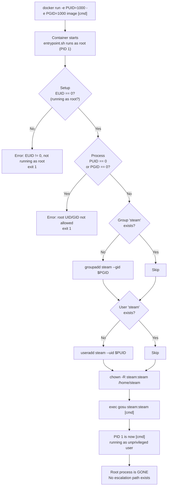

# docker-user-jail-mvp

A minimal Docker integration template that demonstrates how to run a container as root during initialisation and then permanently hand off control to an unprivileged user at runtime — with no way back.

---

## The problem

Docker containers often need to run as root for setup tasks: installing packages, creating users, adjusting file ownership on mounted volumes. But leaving the actual workload running as root is a security risk — if the application is ever compromised, an attacker has full root access inside the container and a much easier path to the host.

The naive fix — using the `USER` directive in the Dockerfile — doesn't work cleanly when the UID/GID need to match the host's file ownership (which is only known at runtime, not build time).

This project solves both problems cleanly.

---

## How it works

The container starts as root. The `entrypoint.sh` does all the setup that requires elevated privileges:

1. Verifies it is actually running as root — fails fast with a clear error if not
2. Rejects `PUID=0` or `PGID=0` — running the workload as root is never allowed
3. Creates the group with the requested GID (`PGID`) if it does not already exist
4. Creates the user with the requested UID (`PUID`) if it does not already exist
5. Fixes ownership of the home directory
6. Calls `exec gosu <user>:<group> <command>`

That last step is the jail. `exec` **replaces** the current process entirely — the root shell that ran the entrypoint ceases to exist. `gosu` drops privileges at the kernel level and hands control to your application. From that point forward, PID 1 is your application, running as an unprivileged user. Root is gone. There is nothing to escalate back to.

---

## What is EUID?

`EUID` stands for **Effective User ID** — the UID the kernel actually checks when deciding whether a process has permission to do something. In most cases it matches `UID` (the real user ID), but they can differ when a process uses `setuid` to temporarily elevate or drop privileges. For our purposes: if `EUID` is `0`, the process has root-level kernel permissions right now.

This is the value `entrypoint.sh` checks first, before doing any setup work.

---

## Workflow



---

## The security model explained

### Why not just set `USER` in the Dockerfile?

The `USER` instruction in a Dockerfile sets a fixed user for all subsequent instructions and the final container process. It cannot react to runtime input — you cannot pass a `PUID`/`PGID` environment variable and have the `USER` instruction pick it up. You also cannot `chown` directories at runtime without root. This approach solves all of that.

### Why `gosu` instead of `su` or `sudo`?

| Tool | Behaviour | Problem |
|---|---|---|
| `sudo` | Forks a privileged helper process | Root process stays alive; `sudo` binary remains available as an attack surface |
| `su` | Also forks; uses the system's login infrastructure (user authentication, session setup, environment loading) | All that overhead exists to serve interactive logins — none of it is needed or appropriate in a container; not designed for containers, and the root parent process still lingers |
| `gosu` | `setuid` + `setgid` + `exec` in one step | No fork, no parent, no root remnant — purpose-built for this pattern |

`gosu` does exactly three things: set the GID, set the UID, exec the command. After that, it no longer exists.

### Why `exec gosu` and not just `gosu`?

Without `exec`, the shell running `entrypoint.sh` stays alive as PID 1 (as root), and `gosu` runs as a child process. The root shell is still there.

With `exec`, the shell **is replaced** by the process that `gosu` hands off to. The root shell is gone at the OS level — not just "doing nothing", but literally no longer a process.

### Why does the shebang matter?

`EUID` is introduced in the [What is EUID?](#what-is-euid) section above. The root check in `entrypoint.sh` relies on it — but that check only works correctly because the shebang is `#!/usr/bin/env bash`. Here is why that matters.

In `entrypoint.sh`, the guard is:

```bash
if [[ "${EUID}" -ne 0 ]]; then
    echo ">>> [Entrypoint] Requires root to run setup (creating users, fixing file ownership)."
    echo "    The container process is currently running as EUID=${EUID}. Please start the container without a --user override."
    exit 1
fi
```

This only works correctly because the shebang is `#!/usr/bin/env bash`.

`$EUID` is a **bash-specific read-only variable** — bash sets it automatically when the shell starts. If you were to change the shebang to `#!/usr/bin/env sh` (which resolves to `dash` on Debian/Ubuntu, or `busybox sh` on Alpine), `$EUID` would simply be empty. The comparison `"" -ne 0` would throw an integer error, or worse, silently evaluate in an unexpected way depending on the shell implementation. Either way, your guard is gone.

The same applies to `[[ ]]` (double-bracket conditionals) — these are a bash built-in and do not exist in POSIX `sh`. If you swap the shebang for `sh`, those comparisons break too.

**Do not change the shebang.** The security checks only work in bash. If you change `bash` to `sh`, the checks stop working — and you will not get an error message telling you that. The script will just run as if the checks passed.

### Guard rails

Two checks run before any setup work begins:

**1. The container must be running as root.**
The entrypoint checks the `EUID` value — see [What is EUID?](#what-is-euid) above for what that means. If the check fails, the entrypoint exits immediately. This prevents silent failures from setup commands (`groupadd`, `useradd`, `chown`) being attempted without the necessary privileges.

**2. `PUID` and `PGID` must not be `0`.**
UID `0` and GID `0` are reserved by the OS for root. You cannot assign them to another user — `useradd` and `usermod` will either refuse outright or produce a second root-equivalent account, which breaks the system in ways that are hard to predict. Beyond that mechanical restriction, even if it somehow succeeded, the "unprivileged" process handed off by `gosu` would have root's UID and therefore root-level access. The entrypoint exits immediately if either value is zero so the misconfiguration is caught early with a clear error, rather than producing a container that silently runs as root.

### The PUID / PGID pattern

When you bind-mount a host directory into a container, the files are owned by a host UID/GID. If the container user has a different UID, it cannot write to those files. By accepting `PUID` and `PGID` as environment variables at runtime, the entrypoint creates the in-container user with exactly the right IDs to match host ownership — without hardcoding anything in the image.

---

## Environment variables

| Variable | Default | Description |
|---|---|---|
| `PUID` | `7351` | UID to assign to the in-container user. Must not be `0`. |
| `PGID` | `2431` | GID to assign to the in-container group. Must not be `0`. |

---

## Usage

### Build

```bash
./docker-build.sh
# or: docker build -t user-jail-mvp:local .
```

### Run with default IDs

```bash
./docker-run.sh [command]
# or: docker run --rm user-jail-mvp:local [command]
```

### Run with custom IDs

```bash
./docker-run-other-ids.sh [command]
# or: docker run --rm -e PUID=1000 -e PGID=1000 user-jail-mvp:local [command]
```

### Verify the jail

```bash
# Check the effective user identity — should show steam's UID, never root
./docker-exec.sh
# uid=7351(steam) gid=2431(steam) groups=2431(steam)

# Open an interactive shell as the jailed user
./docker-exec-ti.sh
```

### Testing both entrypoint paths

The `Dockerfile` contains a commented-out `RUN` block that pre-creates the `steam` user and group at build time. This lets you observe both code paths in `entrypoint.sh` without changing anything else:

- **Uncomment** the block, rebuild, and run → entrypoint prints `Found group steam` / `Found user steam` and skips creation
- **Comment it back out**, rebuild, and run → entrypoint prints `NOT found a group, creating it` / `NOT found a user, creating it`

Both paths converge at `exec gosu` and produce the same jailed result.

---

## Using this as a template

This repository is an **integration template**, not a base image to layer on top of blindly. The security guarantee only holds if the jail pattern in `entrypoint.sh` is preserved correctly.

The right way to use this:

1. **Copy** this repository as your starting point
2. Add your application's installation steps to the `Dockerfile` — these can run as root, that is intentional
3. Keep `entrypoint.sh` as the `ENTRYPOINT` — extend it if you need extra setup steps, but always keep `exec gosu` as the **last line**. The `exec` keyword does not start a new process — it overwrites the running shell with your application. The shell that did the setup work ceases to exist; your application takes its place. Remove `exec` and the root shell survives as a silent, forgotten parent process
4. Never add logic after the `exec gosu` line — it will never execute, and attempting to restructure it away from being the final `exec` breaks the jail
5. Never change the shebang from `#!/usr/bin/env bash` to `sh` — as explained in [Why does the shebang matter?](#why-does-the-shebang-matter), the security checks are bash-specific and will silently stop working under any POSIX `sh` implementation

The entrypoint is the security boundary. Treat it as such.

